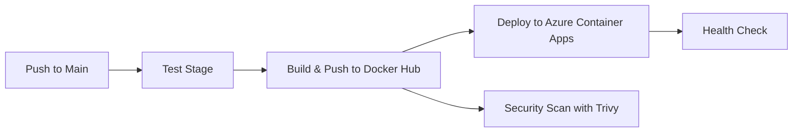

<p align="center">
  
  
  
</p>

# VeriRAG - The Azure-Native AI Librarian

> **A cloud-native RAG platform that delivers trustworthy answers through dual-agent verification and LLM failover, with a clear production path on Azure Container Apps.**

VeriRAG is an intelligent document library system that ingests PDFs, converts them to vector embeddings, and answers user questions with **verified, citation-backed responses**. Every AI-generated answer passes through a **Critic Agent** that scores faithfulness against the source material. If the score falls below a configurable threshold, the system automatically fails over to a backup LLM and regenerates the response.

**Positioning:** A cloud-native RAG system that ensures trustworthy AI responses through verification and fallback mechanisms.

---

## Architecture Overview

```
┌─────────────────────────────────────────────────────────────────────────┐
│                         FRONTEND (React + Vite)                        │
│   Dashboard  ·  Mission Control  ·  Analytics  ·  Bento Grid UI       │
└──────────────────────────────┬──────────────────────────────────────────┘
                               │ JWT Auth (SimpleJWT)
                               ▼
┌─────────────────────────────────────────────────────────────────────────┐
│                      BACKEND (Django REST Framework)                   │
│                                                                        │
│  ┌──────────┐  ┌──────────────┐  ┌──────────────┐  ┌───────────────┐  │
│  │ Document │  │   RAG Query  │  │   System     │  │   Health      │  │
│  │ CRUD API │  │   + Verify   │  │   Insights   │  │   Check       │  │
│  └────┬─────┘  └──────┬───────┘  └──────────────┘  └───────────────┘  │
│       │               │                                                │
│       ▼               ▼                                                │
│  ┌─────────────────────────────────────────────┐                       │
│  │         VeriRAG AI Engine (rag_logic.py)     │                       │
│  │                                             │                       │
│  │  ┌───────────┐    ┌──────────────────────┐  │                       │
│  │  │  Gemini   │───▶│  Critic Agent        │  │                       │
│  │  │ (Primary) │    │  (Faithfulness       │  │                       │
│  │  └───────────┘    │   Verification)      │  │                       │
│  │       │ failover  └──────────────────────┘  │                       │
│  │       ▼                                     │                       │
│  │  ┌───────────┐                              │                       │
│  │  │ Groq/     │                              │                       │
│  │  │ Llama-3   │                              │                       │
│  │  │ (Backup)  │                              │                       │
│  │  └───────────┘                              │                       │
│  └─────────────────────────────────────────────┘                       │
└──────┬──────────────┬──────────────┬──────────────┬────────────────────┘
       │              │              │              │
       ▼              ▼              ▼              ▼
  ┌─────────┐   ┌──────────┐  ┌──────────────┐  ┌──────────────┐
  │PostgreSQL│   │  Redis   │  │ Azure Key    │  │ Azure Monitor│
  │+ pgvector│   │ (Broker) │  │ Vault /.env  │  │ / Grafana    │
  └─────────┘   └──────────┘  └──────────────┘  └──────────────┘
```

### Request Lifecycle

1. **User uploads a PDF** → Django saves it → Celery worker ingests it → LangChain chunks text → Google Embeddings → stored in **pgvector**
2. **User asks a question** → Similarity search in pgvector → **Gemini** generates answer → **Critic Agent** scores faithfulness
3. If faithfulness < `0.6` → answer is **rejected** → re-generated with **Groq/Llama-3** using a stricter prompt
4. Final response includes: answer, faithfulness score, source citations, and verification status

---

## Tech Stack

| Layer | Technology | Purpose |
|-------|-----------|---------|
| **Frontend** | React 19, Vite 7, Tailwind CSS | Bento Grid UI with glassmorphism aesthetic |
| **Backend** | Django 5.0, Django REST Framework | RESTful API with JWT authentication |
| **Primary LLM** | Google Gemini 1.5 Flash | Main response generation (JSON mode) |
| **Backup LLM** | Groq / Llama-3 8B | Automatic failover for hallucination recovery |
| **Vector DB** | PostgreSQL 16 + pgvector | Semantic similarity search on document embeddings |
| **Embeddings** | Google `text-embedding-004` | 768-dim vectors via LangChain |
| **Task Queue** | Celery + Redis 7 | Async document ingestion & scheduled tasks |
| **Secret Management** | Azure Key Vault (prod) / `.env` (demo) | Secure key management with a simple local path |
| **Observability** | Azure Monitor (primary) / Grafana (optional) | Runtime health, latency, and verification metrics |
| **Infrastructure as Code** | Terraform | Single source of truth for cloud provisioning |
| **Cloud Runtime** | Azure Container Apps + ACR | Primary production deployment story |

---

## Local Development Setup

### Prerequisites

- **Docker Desktop** (v4.x+) with Docker Compose
- **Git**
- **Google API Key** (for Gemini + Embeddings) — [Get one here](https://aistudio.google.com/app/apikey)
- **Groq API Key** (optional, for fallback LLM) — [Get one here](https://console.groq.com/)
- **Node.js 18+** and **npm** (for frontend development)

### Step 1: Clone & Configure

```bash
git clone https://github.com/VaibhavKumar2005/cloud-native-ai-library-system.git
cd cloud-native-ai-library-system
```

Create a `.env` file in the project root:

```env
# === Core Secrets ===
DJANGO_SECRET_KEY=your-random-secret-key-here
GOOGLE_API_KEY=AIza...your-google-api-key
GROQ_API_KEY=gsk_...your-groq-api-key

# === Database ===
POSTGRES_USER=admin
POSTGRES_PASSWORD=devpassword
POSTGRES_DB=verirag_db
POSTGRES_HOST=rag-db
POSTGRES_PORT=5432

# === Redis ===
REDIS_URL=redis://rag-redis:6379/0

# === App Settings ===
DEBUG=True
ALLOWED_HOSTS=localhost,127.0.0.1,0.0.0.0,backend,rag-backend
```

### Step 2: Start the Infrastructure

```bash
docker-compose up -d --build
```

This spins up the local stack for development: PostgreSQL (pgvector), Redis, Django backend, Celery worker, and Celery beat.

### Step 3: Configure Secrets Mode

For local demo work, keep secrets in `.env`.

For production, move secrets to **Azure Key Vault** and inject them through your deployment configuration.

### Step 4: Run Database Migrations

```bash
docker exec -it rag-backend python manage.py migrate
docker exec -it rag-backend python manage.py createsuperuser
```

### Step 5: Start the Frontend

```bash
cd frontend
npm install
npm run dev
```

The frontend will be available at `http://localhost:5173` and the backend API at `http://localhost:8000`.

### Step 6: Verify Everything

| Service | URL | Credentials |
|---------|-----|-------------|
| Frontend Dashboard | http://localhost:5173 | Your superuser credentials |
| Django Admin | http://localhost:8000/admin/ | Superuser |
| Swagger API Docs | http://localhost:8000/api/schema/swagger-ui/ | JWT Token |
| Metrics (optional) | Grafana / Azure Monitor | Configure per environment |

---

## Project Structure

```
cloud-native-ai-library-system/
├── apps/                       # Application services (frontend + backend)
│   ├── backend/                # Django REST API
│   │   ├── ai_engine/          # Core RAG + Verification engine
│   │   │   ├── rag_logic.py    # Dual-agent verification pipeline
│   │   │   ├── views.py        # API endpoints
│   │   │   ├── models.py       # Document model (multi-tenant)
│   │   │   ├── tasks.py        # Celery async tasks
│   │   │   ├── tracing.py      # OpenTelemetry integration
│   │   │   └── benchmarks.py   # Performance benchmarks
│   │   ├── rag_backend/        # Django project settings
│   │   │   ├── settings.py     # Production-grade config
│   │   │   ├── celery.py       # Celery app configuration
│   │   │   └── urls.py         # URL routing
│   │   ├── tests/              # Pytest test suite
│   │   │   ├── conftest.py     # Shared fixtures (mocked Vault)
│   │   │   └── test_rag_logic.py # RAG engine unit tests
│   │   ├── Dockerfile
│   │   └── requirements.txt
│   └── frontend/               # React + Vite + Tailwind CSS
│       ├── src/
│       │   ├── Dashboard.jsx   # Main library + AI chat (Bento Grid)
│       │   ├── Monitoring.jsx  # Mission Control telemetry
│       │   └── Analytics.jsx   # Query analytics dashboard
│       └── package.json
├── ops/                        # Operations & Infrastructure
│   ├── k8s/                    # Optional Kubernetes assets (secondary path)
│   │   ├── namespace.yaml      # verirag namespace
│   │   ├── configmap.yaml      # Non-sensitive environment config
│   │   ├── secrets.yaml        # Base64-encoded secrets (template)
│   │   ├── deployment.yaml     # Backend, Celery, Redis deployments
│   │   ├── service.yaml        # ClusterIP + NodePort services
│   │   ├── statefulset.yaml    # PostgreSQL with persistent storage
│   │   └── kustomization.yaml  # Kustomize resource manager
│   ├── infrastructure/         # Terraform (Azure Container Apps + ACR)
│   │   └── main.tf
│   ├── gitops/                 # Optional GitOps experiments
│   ├── helm/                   # Optional Helm packaging
│   └── vault/                  # Legacy/optional secret-management setup
├── docs/                       # Extended documentation
│   ├── ARCHITECTURE.md         # Dual-agent verification protocol
│   ├── API_SPEC.md             # REST API reference
│   ├── SECURITY.md             # Vault + JWT + CSP security model
│   ├── guides/                 # Demo, deployment, testing guides
│   ├── reports/                # Status, security, and summary docs
│   └── showcase/               # Presentation-facing architecture material
├── scripts/                    # Helper scripts grouped by purpose
│   ├── demo/                   # Demo launch and health checks
│   ├── security/               # Security audit and cleanup tools
│   ├── setup/                  # Environment and Vault setup
│   └── testing/                # API and pipeline test runners
├── docker-compose.yml          # Local development orchestration
├── prometheus.yml              # Prometheus scrape configuration
└── railway.json                # Railway deployment configuration
```

---

## Testing

```bash
# Run backend tests with Pytest
cd apps/backend
pytest tests/ -v --tb=short

# Run with coverage report
pytest tests/ --cov=ai_engine --cov-report=term-missing
```

See [docs/ARCHITECTURE.md](docs/ARCHITECTURE.md) for the dual-agent verification logic, [docs/API_SPEC.md](docs/API_SPEC.md) for complete API documentation, and [docs/README.md](docs/README.md) for the reorganized documentation index.

---

## Kubernetes Deployment

Production-grade Kubernetes manifests are in `ops/k8s/`. Apply them with Kustomize:

```bash
# Apply all resources via Kustomize
kubectl apply -k ops/k8s/

# Verify pods are running
kubectl get pods -n verirag

# Check services
kubectl get svc -n verirag

# View logs
kubectl logs -n verirag deployment/rag-backend --tail=50
```

For GitOps workflows, point Argo CD or Flux to the `k8s/` directory.

---

## CI/CD Pipeline

VeriRAG uses **GitHub Actions** for automated testing, building, and deployment:

### Pipeline Stages



### Features

- **Automated Testing**: Runs Django tests and frontend build validation on every PR
- **Docker Image Building**: Creates optimized images with build caching
- **Docker Hub Publishing**: Tags images with git SHA and `latest`
- **Azure Deployment**: Auto-deploys to Container Apps with KEDA scale-to-zero
- **Security Scanning**: Trivy scans for vulnerabilities, reports to GitHub Security
- **Health Verification**: Validates deployment with `/api/health/` endpoint

### Quick Start

1. **Add GitHub secrets and variables** (see [GITHUB_ACTIONS_SETUP.md](GITHUB_ACTIONS_SETUP.md)):
   - `REGISTRY_USERNAME`
   - `REGISTRY_PASSWORD`
   - `AZURE_CREDENTIALS`

2. **Make a commit and push** to run CI only:
   ```bash
   git add .
   git commit -m "feat: add new feature with proper commit message"
   git push origin main
   ```

3. **Trigger deployment manually** from the GitHub Actions tab using `VeriRAG Manual ACA Deploy`

4. **View deployment** after the manual workflow completes at your Azure Container Apps URL

For detailed setup instructions and best practices, see:
- [GitHub Actions Setup Guide](GITHUB_ACTIONS_SETUP.md)
- [Git Workflow Best Practices](.github/GIT_WORKFLOW.md)

---

## Observability

- **Prometheus** scrapes custom metrics at `/metrics`:
  - `verirag_hallucination_rejections_total` — blocked hallucinations
  - `verirag_llm_fallbacks_total` — Gemini → Groq failovers
  - `verirag_queries_total` — total RAG queries
  - `verirag_documents_ingested_total` — processed documents
  - `verirag_faithfulness_score` — histogram of confidence scores
- **Grafana** dashboards visualize real-time AI integrity and infrastructure health
- **OpenTelemetry** provides distributed tracing across Django → Celery → pgvector

---

## Documentation

| Document | Description |
|----------|-------------|
| [ARCHITECTURE.md](docs/ARCHITECTURE.md) | Dual-agent (Gemini + Llama-3/Groq) verification protocol |
| [API_SPEC.md](docs/API_SPEC.md) | Full REST API endpoint reference with request/response schemas |
| [SECURITY.md](docs/SECURITY.md) | HashiCorp Vault integration, JWT auth, CSP policies |
| [docs/README.md](docs/README.md) | Navigation index for guides, reports, and showcase material |

---

## Team 96 - The Azure-Native AI Librarian

Built for the Azure Cloud-Native hackathon.

---

## License

This project is licensed under the MIT License — see the [LICENSE](LICENSE) file for details.
